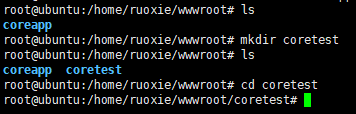
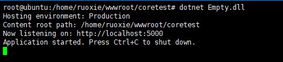

### 环境及工具

* `Ubuntu 16.04.2 LTS`
* .NET Core程序运行环境
* Xshell
* Supervisor

### 安装.NET Core SDK

使用`Xshell`远程登录Linux服务器，执行如下脚本

```bash
wget -q https://packages.microsoft.com/config/ubuntu/16.04/packages-microsoft-prod.deb
sudo dpkg -i packages-microsoft-prod.deb
sudo apt-get install apt-transport-https
sudo apt-get update
sudo apt-get install dotnet-sdk-2.2
```

验证是否安装成功：`dotnet --version`


[其他系统安装信息](https://dotnet.microsoft.com/download)

### 直接运行.NET Core程序

**创建项目运行目录**



通过`rz`命令将windows下发布的程序拷贝到刚才建的目录下


**运行程序**




>程序正常启动了的，但是默认情况下外网是无法访问的，需要修改代码如下
```csharp
 WebHost.CreateDefaultBuilder(args)
    .UseUrls("http://*:5000")
    .UseStartup<Startup>()
    .Build();
```

后台运行
>nohup dotnet &  Empty.dll

查询后台进程
>ps -aux|grep Empty.dll

按端口占用查询
>lsof -i:5000

>netstat -ap|grep 5000

根据进程id查询占用端口
>netstat -nap|grep 7779

终止后台运行的进程
>kill -9 7779

### 使用Supervisor

安装
> apt-get install supervisor

修改`/etc/supervisor`下文件`supervisord.conf`

```shell
; supervisor config file

[unix_http_server]
file=/var/run/supervisor.sock   ; (the path to the socket file)
chmod=0700                       ; sockef file mode (default 0700)

[supervisord]
logfile=/var/log/supervisor/supervisord.log ; (main log file;default $CWD/supervisord.log)
pidfile=/var/run/supervisord.pid ; (supervisord pidfile;default supervisord.pid)
childlogdir=/var/log/supervisor            ; ('AUTO' child log dir, default $TEMP)

; the below section must remain in the config file for RPC
; (supervisorctl/web interface) to work, additional interfaces may be
; added by defining them in separate rpcinterface: sections
[rpcinterface:supervisor]
supervisor.rpcinterface_factory = supervisor.rpcinterface:make_main_rpcinterface

[supervisorctl]
serverurl=unix:///var/run/supervisor.sock ; use a unix:// URL  for a unix socket

; The [include] section can just contain the "files" setting.  This
; setting can list multiple files (separated by whitespace or
; newlines).  It can also contain wildcards.  The filenames are
; interpreted as relative to this file.  Included files *cannot*
; include files themselves.

[include]
files = /etc/supervisor/conf.d/*.conf
```
>确保最后一行一致

在目录`/etc/supervisor/conf.d/`下新建`coretest.conf`文件

>touch coretest.conf

写入如下命令
```bash
[program:coretest]
directory=/home/ruoxie/wwwroot/coretest #执行命令的目录
command=dotnet Empty.dll #要执行的命令
autostart=true #是否自动启动
autorestart=true #是否自动重启
startretries=10 #自动重启间隔
redirect_stderr=true
stderr_logfile=/home/ruoxie/wwwroot/coretest/coretest.err.log #标准错误日志
stdout_logfile=/home/ruoxie/wwwroot/coretest/coretest.log #标准输出日志
```
重新加载配置
>supervisorctl shutdown && sudo supervisord -c /etc/supervisor/supervisord.conf

或者重启重启 Supervisor
>service supervisor stop

>service supervisor start

Supervisor 常用命令
>supervisorctl shutdown #关闭所有任务

>supervisorctl stop|start program_name

>supervisorctl status #查看所有任务状态