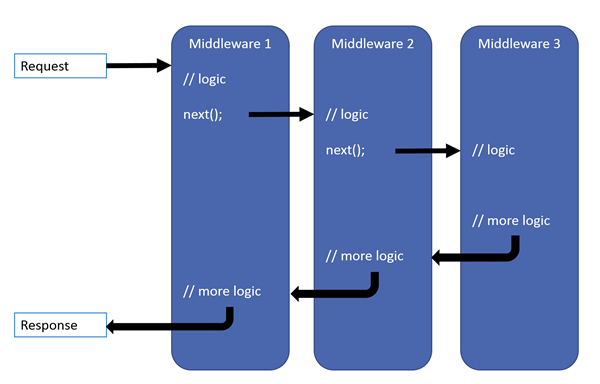
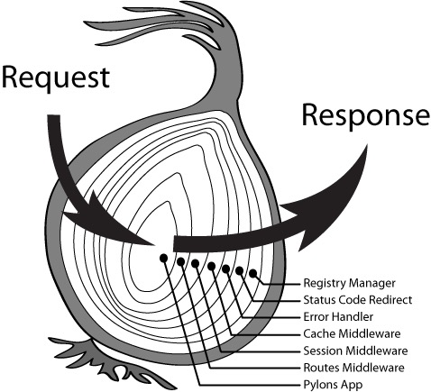
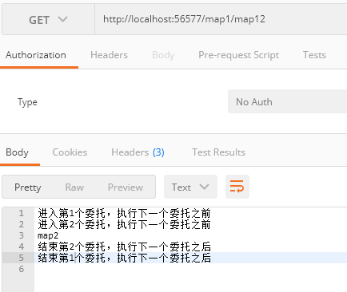

中间件是用于组成应用程序管道来处理请求和响应的组件。管道内的每一个组件都可以选择是否将请求交给下一个组件、并在管道中调用下一个组件之前和之后执行某些操作。请求委托被用来建立请求管道，请求委托处理每一个 HTTP 请求。



每个委托可以在下一个委托之前和之后执行操作。委托还可以决定不将请求传递给下一个委托，这称为请求管道的短路。

### Run

最简单的可能是ASP.NET Core应用程序建立一个请求的委托，处理所有的请求。此案例不包含实际的请求管道。相反，针对每个HTTP请求都调用一个匿名方法。

```csharp
app.Run(async (context) =>
{
    await context.Response.WriteAsync("Hello World!");
});
```
不管在浏览器地址栏输入什么，都会返回"Hello World!"


第一个**app.Run**委托会终止管道
```csharp
app.Run(async (context) =>
{
    await context.Response.WriteAsync("Hello World!");
});

app.Run(async (context) =>
{
    await context.Response.WriteAsync("管道已经被终止!");
});
```
只有"Hello World!"会被返回
### Use
如果需要使用多个委托处理HTTP请求，可以使用**Use**将他们链接在一起。

```csharp
app.Use(async (context, next) =>
{
    await context.Response.WriteAsync("进入第1个委托，执行下一个委托之前\r\n");
    await next();
    await context.Response.WriteAsync("结束第1个委托，执行下一个委托之后\r\n");
});
app.Use(async (context, next) =>
{
    await context.Response.WriteAsync("进入第2个委托，执行下一个委托之前\r\n");
    await next();
    await context.Response.WriteAsync("结束第2个委托，执行下一个委托之后\r\n");
});
app.Run(async (context) =>
{
    await context.Response.WriteAsync("Hello World!\r\n");
});
```




nodejs koa 洋葱模型


中间件的注册顺序也很重要

```csharp
    app.UseExceptionHandler("/Error");
    // Use HTTPS Redirection Middleware to redirect HTTP requests to HTTPS.
    app.UseHttpsRedirection();

    // Return static files and end the pipeline.
    app.UseStaticFiles();

    // Use Cookie Policy Middleware to conform to EU General Data 
    // Protection Regulation (GDPR) regulations.
    app.UseCookiePolicy();

    // Authenticate before the user accesses secure resources.
    app.UseAuthentication();

    // If the app uses session state, call Session Middleware after Cookie 
    // Policy Middleware and before MVC Middleware.
    app.UseSession();

    // Add MVC to the request pipeline.
    app.UseMvc();
```

异常处理中间件应该放到第一个，这样它就能捕获后面调用中发生的任何异常。

将非HTTPS重定向到HTTP域的中间件也应该比较前面，如果先经过Session等中间件处理，就会浪费服务器资源做不必要的解析。

尽早在管道中调用静态文件中间件，以便它可以处理请求并使其短路，而无需通过剩余组件。

身份验证的中间件(**app.UseAuthentication()**)不会使请求发生短路，作用是设置**HttpContext.User**上相关信息，短路操作是在MVC控制器执行的时候(加上**Authorize**特性)。

>[UseAuthentication源码](https://github.com/aspnet/AspNetCore/blob/master/src/Security/Authentication/Core/src/AuthenticationMiddleware.cs)，[Authorize特性源码](https://github.com/aspnet/AspNetCore/blob/master/src/Mvc/src/Microsoft.AspNetCore.Mvc.Core/Authorization/AuthorizeFilter.cs)


### Map
Map 扩展用来创建管道分支。 Map* 基于给定请求路径的匹配项来创建请求管道分支。 如果请求路径以给定路径开头，则执行分支
```csharp
app.Map("/map1", (level1app) =>
{
    level1app.Use(async (context, next) =>
    {
        await context.Response.WriteAsync("进入第1个委托，执行下一个委托之前\r\n");
        await next();
        await context.Response.WriteAsync("结束第1个委托，执行下一个委托之后\r\n");
    });
    level1app.Use(async (context, next) =>
    {
        await context.Response.WriteAsync("进入第2个委托，执行下一个委托之前\r\n");
        await next();
        await context.Response.WriteAsync("结束第2个委托，执行下一个委托之后\r\n");
    });
    level1app.Map("/map12", (level2app) =>
    {
        //level1app.use 注册的委托会调用
        level2app.Run(async (context) =>
        {
            await context.Response.WriteAsync("map2\r\n");
        });
    });
    level1app.Run(async (context) =>
    {
        await context.Response.WriteAsync("map1\r\n");
    });
    //不管app.run 在 level1app.Run之前还是之后，分支管道都会被阻断，没有任何输出
    //app.Run(async (context) =>
    //{
    //    await context.Response.WriteAsync("Hello World!\r\n");
    //});
});
```



MapWhen 基于给定谓词的结果创建请求管道分支。 Func<HttpContext, bool> 类型的任何谓词均可用于将请求映射到管道的新分支。 在以下示例中，谓词用于检测查询字符串变量 branch 是否存在：

```csharp
app.MapWhen(context => context.Request.Query.ContainsKey("branch"), (level1app) =>
{
    level1app.Run(async (context) =>
    {
        var branchVer = context.Request.Query["branch"];
        await context.Response.WriteAsync($"Branch used = {branchVer}");
    });
});

```


### 内置中间件

ASP.NET Core 附带以下中间件组件。

|中间件|描述|顺序|
|---|---|---|
|身份验证|提供身份验证支持。|在需要 HttpContext.User 之前。 OAuth 回叫的终端。
|Cookie 策略|跟踪用户是否同意存储个人信息，并强制实施 cookie 字段（如 secure 和 SameSite）的最低标准。|在发出 cookie 的中间件之前。 示例：身份验证、会话、MVC (TempData)。
|CORS|配置跨域资源共享。|在使用 CORS 的组件之前。
|诊断|配置诊断。|在生成错误的组件之前。
|转接头|将代理标头转发到当前请求。|在使用已更新字段的组件之前。 示例：方案、主机、客户端 IP、方法。
|运行状况检查|检查 ASP.NET Core 应用及其依赖项的运行状况，如检查数据库可用性。|如果请求与运行状况检查终结点匹配，则为终端。
|HTTP 方法重写|允许传入 POST 请求重写方法。|在使用已更新方法的组件之前。
|HTTPS 重定向|将所有 HTTP 请求重定向到 HTTPS（ASP.NET Core 2.1 或更高版本）。|在使用 URL 的组件之前。
|HTTP 严格传输安全性 (HSTS) |添加特殊响应标头的安全增强中间件（ASP.NET Core 2.1 或更高版本）。|在发送响应之前，修改请求的组件之后。 示例：转接头、URL 重写。
|MVC|用 MVC/Razor Pages 处理请求（ASP.NET Core 2.0 或更高版本）。|如果请求与路由匹配，则为终端。
|OWIN|与基于 OWIN 的应用、服务器和中间件进行互操作。|如果 OWIN 中间件处理完请求，则为终端。
|响应缓存|提供对缓存响应的支持。|在需要缓存的组件之前。
|响应压缩|提供对压缩响应的支持。|在需要压缩的组件之前。
|请求本地化|提供本地化支持。|在对本地化敏感的组件之前。
|路由|定义和约束请求路由。|用于匹配路由的终端。
|会话|提供对管理用户会话的支持。|在需要会话的组件之前。
|静态文件|为提供静态文件和目录浏览提供支持。|如果请求与文件匹配，则为终端。
|URL 重写|提供对重写 URL 和重定向请求的支持。|在使用 URL 的组件之前。
|WebSockets |启用 WebSockets 协议。|在接受 WebSocket 请求所需的组件之前。

### 编写中间件

通常，中间件通过扩展方法公开。

`MyMiddlewareExtensions.cs`
```csharp
public static class MyMiddlewareExtensions
{
    public static IApplicationBuilder UseMyMiddleware(this IApplicationBuilder app)
    {
        app.Run(async (context) =>
        {
            await context.Response.WriteAsync("MyMiddleware!\r\n");
        });
        return app;
    }
}
```
>是否阻断管道由中间件控制

```csharp
app.UseMyMiddleware();
```


**将中间件委托移到类中**

`MyMiddleware.cs`
```csharp
public class MyMiddleware
{
    private readonly RequestDelegate _next;

    public MyMiddleware(RequestDelegate next)
    {
        _next = next;
    }

    public async Task InvokeAsync(HttpContext context)
    {
        await context.Response.WriteAsync("MyMiddleware Build In Class!\r\n");
        await _next(context);//不调用next，则阻断管道
    }
}
```
`MyMiddlewareExtensions.cs`
```csharp
public static class MyMiddlewareExtensions
{
    public static IApplicationBuilder UseMyMiddleware(this IApplicationBuilder app)
    {
        app.Run(async (context) =>
        {
            await context.Response.WriteAsync("MyMiddleware!\r\n");
        });
        return app;
    }
    public static IApplicationBuilder UseMyMiddlewareByClass(this IApplicationBuilder app)
    {
        app.UseMiddleware<MyMiddleware>();
        return app;
    }
}
```
```csharp
app.UseMyMiddlewareByClass();
app.UseMyMiddleware();
```


