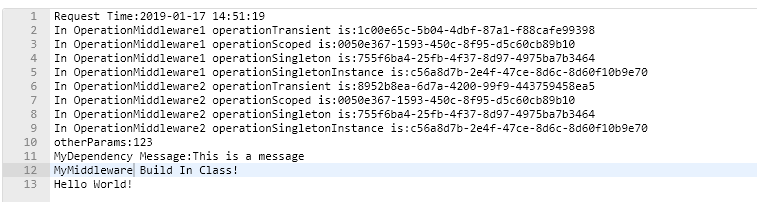
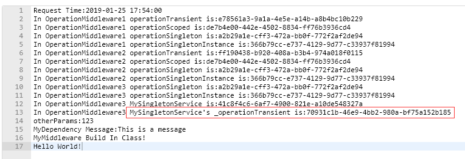

ASP.NET Core 支持依赖关系注入 (DI) 软件设计模式，这是一种在类及其依赖关系之间实现控制反转 (IoC) 的技术。

### 依赖注入概述

依赖项是另一个对象所需的任何对象。

```csharp
public class MyDependency
{
    public MyDependency()
    {
    }

    public Task WriteMessage(string message)
    {
        Console.WriteLine(
            $"MyDependency.WriteMessage called. Message: {message}");

        return Task.FromResult(0);
    }
}
```

可以创建 MyDependency 类的实例以使 WriteMessage 方法可用于类。 MyDependency 类是 IndexModel 类的依赖项：

```csharp
public class IndexModel : PageModel
{
    MyDependency _dependency = new MyDependency();

    public async Task OnGetAsync()
    {
        await _dependency.WriteMessage(
            "IndexModel.OnGetAsync created this message.");
    }
}
```
该类创建并直接依赖于 MyDependency 实例。 代码依赖关系（如前面的示例）存在问题，应该避免使用，原因如下：

* 要用不同的实现替换 MyDependency，必须修改类。
* 如果 MyDependency 具有依赖关系，则必须由类对其进行配置。 在具有多个依赖于 MyDependency 的类的大型项目中，配置代码在整个应用中会变得分散。
* 很难进行单元测试。比如不能使用模拟的MyDependency类型进行测试。

依赖关系注入通过以下方式解决了这些问题：

* 使用接口抽象化依赖关系实现。
* 注册服务容器中的依赖关系。 ASP.NET Core 提供了一个内置的服务容器 IServiceProvider。 服务在应用的 Startup.ConfigureServices 方法中注册。
* 将服务注入到使用它的类的构造函数中。 框架负责创建依赖关系的实例，并在不再需要时对其进行处理。
>除了构造函数注入还有属性注入，接口注入。

### 将服务注入到中间件中
```csharp
public interface IMyDependency
{
    Task<string> GetMessage(string message);
}
```
```csharp
public class MyDependency : IMyDependency
{
    public Task<string> GetMessage(string message)
    {
        return Task.FromResult(message);
    }
}
```
注册到容器中
```csharp
public void ConfigureServices(IServiceCollection services)
{
    services.AddScoped<IMyDependency, MyDependency>();
}
```

修改之前的中间件例子
```csharp
public async Task InvokeAsync(HttpContext context,IMyDependency myDependency)
{
    await context.Response.WriteAsync(string.Format("otherParams:{0}\r\n", _otherParams));
    await context.Response.WriteAsync(string.Format("MyDependency Message:{0}\r\n", myDependency.GetMessage("1213").Result));
    await context.Response.WriteAsync("MyMiddleware Build In Class!\r\n");
    await _next(context);//不调用next，则阻断管道
}
```

IMyDependency实例由容器自动注入


ASP.NET Core推荐使用扩展方法的方式添加服务，比如`services.AddMvc()` 添加 Razor Pages 和 MVC 需要的服务。

遵循此约定，将扩展方法置于 Microsoft.Extensions.DependencyInjection 命名空间中以封装服务注册的组。

`MyServiceCollectionExtensions.cs`

```csharp
namespace Microsoft.Extensions.DependencyInjection
{
    public static class MyServiceCollectionExtensions
    {
        public static void AddMyService(this IServiceCollection services)
        {
            services.AddScoped<IMyDependency, MyDependency>();
        }
    }
}
```
```csharp
public void ConfigureServices(IServiceCollection services)
{
    //services.AddScoped<IMyDependency, MyDependency>();
    services.AddMyService();
}
```

### 服务生命周期

**Transient**
服务是每次需要使用时创建的。 这种生存期适合轻量级、 无状态的服务。
>比如两个中间件都依赖于相同服务，一个请求下来，注入的是不同的实例

**Scoped**

服务以每个请求一次的方式创建。
>比如两个中间件都依赖于相同服务，一个请求下来，注入的是相同的实例

**Singleton**
单一实例生存期服务是在第一次请求时（或者在运行 ConfigureServices 并且使用服务注册指定实例时）创建的。 每个后续请求都使用相同的实例。

### 服务生命周期演示

```csharp
public interface IOperationTransient
{
    Guid OperationId { get; }
}
public interface IOperationScoped
{
    Guid OperationId { get; }
}
public interface IOperationSingleton
{
    Guid OperationId { get; }
}
public interface IOperationSingletonInstance
{
    Guid OperationId { get; }
}
```

```csharp
public class Operation : IOperationTransient, IOperationScoped, IOperationSingleton, IOperationSingletonInstance
{
    public Operation()
    {
        OperationId = Guid.NewGuid();
    }
    public Guid OperationId { get; private set; }
}
```
```csharp
public static void AddOperation(this IServiceCollection services)
{
    services.AddTransient<IOperationTransient, Operation>();
    services.AddScoped<IOperationScoped, Operation>();
    services.AddSingleton<IOperationSingleton, Operation>();
    services.AddSingleton<IOperationSingletonInstance>(new Operation());
}
```

`OperationMiddleware1.cs`
```csharp
public class OperationMiddleware1
{
    private readonly RequestDelegate _next;

    public OperationMiddleware1(RequestDelegate next)
    {
        _next = next;
    }

    public async Task InvokeAsync(
        HttpContext context, 
        IOperationTransient operationTransient,
        IOperationScoped operationScoped,
        IOperationSingleton operationSingleton,
        IOperationSingletonInstance operationSingletonInstance
        )
    {
        await context.Response.WriteAsync(string.Format("In OperationMiddleware1 operationTransient is:{0}!\r\n",operationTransient.OperationId.ToString()));
        await context.Response.WriteAsync(string.Format("In OperationMiddleware1 operationScoped is:{0}!\r\n", operationScoped.OperationId.ToString()));
        await context.Response.WriteAsync(string.Format("In OperationMiddleware1 operationSingleton is:{0}!\r\n", operationSingleton.OperationId.ToString()));
        await context.Response.WriteAsync(string.Format("In OperationMiddleware1 operationSingletonInstance is:{0}!\r\n", operationSingletonInstance.OperationId.ToString()));
        await _next(context);
    }
}
```

`OperationMiddleware2.cs`
```csharp
public class OperationMiddleware2
{
    private readonly RequestDelegate _next;

    public OperationMiddleware2(RequestDelegate next)
    {
        _next = next;
    }

    public async Task InvokeAsync(
        HttpContext context,
        IOperationTransient operationTransient,
        IOperationScoped operationScoped,
        IOperationSingleton operationSingleton,
        IOperationSingletonInstance operationSingletonInstance
        )
    {
        await context.Response.WriteAsync(string.Format("In OperationMiddleware2 operationTransient is:{0}!\r\n", operationTransient.OperationId.ToString()));
        await context.Response.WriteAsync(string.Format("In OperationMiddleware2 operationScoped is:{0}!\r\n", operationScoped.OperationId.ToString()));
        await context.Response.WriteAsync(string.Format("In OperationMiddleware2 operationSingleton is:{0}!\r\n", operationSingleton.OperationId.ToString()));
        await context.Response.WriteAsync(string.Format("In OperationMiddleware2 operationSingletonInstance is:{0}!\r\n", operationSingletonInstance.OperationId.ToString()));
        await _next(context);
    }
}
```
```csharp
public static IApplicationBuilder UseOperation(this IApplicationBuilder app)
{
    app.UseMiddleware<OperationMiddleware1>();
    app.UseMiddleware<OperationMiddleware2>();
    return app;
}
```




**Transient**方式注册的服务，同一个请求中，在两个中间件中注入的是两个不同实例。

**Scoped**方式注册的服务，同一个请求中，在两个中间件中注入的是相同实例。不同请求，实例也不同。

**AddSingleton**方式注册的服务，整个应用周期里只有一个实例。
>`services.AddSingleton<IOperationSingletonInstance>(new Operation());`注册的，应用启动的时候就生成实例

### 不正确的作用域

`MySingletonService.cs`
```csharp
public class MySingletonService
{
    private IOperationTransient _operationTransient;
    public MySingletonService(IOperationTransient operationTransient)
    {
        _operationTransient = operationTransient;
        Id = Guid.NewGuid();
    }
    public Guid Id { get; private set; }

    public Guid OperationTransientId
    {
        get { return _operationTransient.OperationId; }
    }
}
```
`OperationMiddleware3.cs`
```csharp
public class OperationMiddleware3
{
    private readonly RequestDelegate _next;
    private IOperationSingleton _operationSingleton;
    private IOperationSingletonInstance _operationSingletonInstance;
    private MySingletonService _mySingletonService;
    public OperationMiddleware3(
        RequestDelegate next,
        IOperationSingleton operationSingleton,
        IOperationSingletonInstance operationSingletonInstance,
        MySingletonService mySingletonService
        )
    {
        _next = next;
        _operationSingleton = operationSingleton;
        _operationSingletonInstance = operationSingletonInstance;
        _mySingletonService = mySingletonService;
    }

    public async Task InvokeAsync(HttpContext context)
    {
        await context.Response.WriteAsync(string.Format("In OperationMiddleware3 operationSingleton is:{0}\r\n", _operationSingleton.OperationId.ToString()));
        await context.Response.WriteAsync(string.Format("In OperationMiddleware3 operationSingletonInstance is:{0}\r\n", _operationSingletonInstance.OperationId.ToString()));
        await context.Response.WriteAsync(string.Format("In OperationMiddleware3 MySingletonService is:{0}\r\n", _mySingletonService.Id.ToString()));
        await context.Response.WriteAsync(string.Format("In OperationMiddleware3 MySingletonService's _operationTransient is:{0}\r\n", _mySingletonService.OperationTransientId.ToString()));
        await _next(context);
    }
}
```
以单例的方式注册`MySingletonService`服务
```csharp
public static void AddOperation(this IServiceCollection services)
{
    services.AddTransient<IOperationTransient, Operation>();
    services.AddScoped<IOperationScoped, Operation>();
    services.AddSingleton<IOperationSingleton, Operation>();
    services.AddSingleton<IOperationSingletonInstance>(new Operation());
    services.AddSingleton<MySingletonService>();
}
```




尽管`IOperationTransient`是以`Transient`方式注册的，但是因为`MySingletonService`是`Singleton`，所以MySingletonService实例中的`MySingletonService`实例不会更新。

>中间件不能通过构造函数注入非`Singleton`注册的服务


