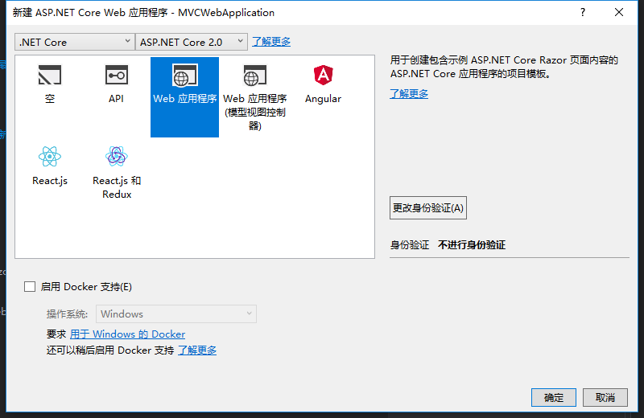

目前官方预置了7种模板项目供我们选择。从中我们可以看出，既有我们熟悉的MVC、WebAPI，又新添加了Razor Page，以及结合比较流行的Angular、React前端框架的模板项目。

### 空项目模板


Program.cs
```csharp
using System;
using System.Collections.Generic;
using System.IO;
using System.Linq;
using System.Threading.Tasks;
using Microsoft.AspNetCore;
using Microsoft.AspNetCore.Hosting;
using Microsoft.Extensions.Configuration;
using Microsoft.Extensions.Logging;

namespace Empty
{
    public class Program
    {
        public static void Main(string[] args)
        {
            BuildWebHost(args).Run();
        }

        public static IWebHost BuildWebHost(string[] args) =>
            WebHost.CreateDefaultBuilder(args)
                .UseStartup<Startup>()
                .Build();
    }
}

```
实质就是控制台应用

Startup.cs
```csharp
using System;
using System.Collections.Generic;
using System.Linq;
using System.Threading.Tasks;
using Microsoft.AspNetCore.Builder;
using Microsoft.AspNetCore.Hosting;
using Microsoft.AspNetCore.Http;
using Microsoft.Extensions.DependencyInjection;

namespace Empty
{
    public class Startup
    {
        // This method gets called by the runtime. Use this method to add services to the container.
        // For more information on how to configure your application, visit https://go.microsoft.com/fwlink/?LinkID=398940
        public void ConfigureServices(IServiceCollection services)
        {
        }

        // This method gets called by the runtime. Use this method to configure the HTTP request pipeline.
        public void Configure(IApplicationBuilder app, IHostingEnvironment env)
        {
            if (env.IsDevelopment())
            {
                app.UseDeveloperExceptionPage();
            }

            app.Run(async (context) =>
            {
                await context.Response.WriteAsync("Hello World!");
            });
        }
    }
}

```
提供最原始的`HttpContext`。

### Web API


创建完整的HTTP服务，使用`Controller`处理请求，仅返回数据无视图返回
```csharp
using System;
using System.Collections.Generic;
using System.Linq;
using System.Threading.Tasks;
using Microsoft.AspNetCore.Mvc;

namespace WebAPIApplication.Controllers
{
    [Route("api/[controller]")]
    public class ValuesController : Controller
    {
        // GET api/values
        [HttpGet]
        public IEnumerable<string> Get()
        {
            return new string[] { "value1", "value2" };
        }

        // GET api/values/5
        [HttpGet("{id}")]
        public string Get(int id)
        {
            return "value";
        }

        // POST api/values
        [HttpPost]
        public void Post([FromBody]string value)
        {
        }

        // PUT api/values/5
        [HttpPut("{id}")]
        public void Put(int id, [FromBody]string value)
        {
        }

        // DELETE api/values/5
        [HttpDelete("{id}")]
        public void Delete(int id)
        {
        }
    }
}

```

Startup.cs也加入了相关的MVC的服务和中间件
```csharp
using System;
using System.Collections.Generic;
using System.Linq;
using System.Threading.Tasks;
using Microsoft.AspNetCore.Builder;
using Microsoft.AspNetCore.Hosting;
using Microsoft.Extensions.Configuration;
using Microsoft.Extensions.DependencyInjection;
using Microsoft.Extensions.Logging;
using Microsoft.Extensions.Options;

namespace WebAPIApplication
{
    public class Startup
    {
        public Startup(IConfiguration configuration)
        {
            Configuration = configuration;
        }

        public IConfiguration Configuration { get; }

        // This method gets called by the runtime. Use this method to add services to the container.
        public void ConfigureServices(IServiceCollection services)
        {
            services.AddMvc();//调用扩展方法添加相关服务
        }

        // This method gets called by the runtime. Use this method to configure the HTTP request pipeline.
        public void Configure(IApplicationBuilder app, IHostingEnvironment env)
        {
            if (env.IsDevelopment())
            {
                app.UseDeveloperExceptionPage();
            }

            app.UseMvc();//添加中间件
        }
    }
}


```
### Web 应用程序-Razor Page


在ASP.NET MVC中Razor作为一个高级视图引擎存在，Razor提供了一种新的标记语义，其大大减少了用户输入且具有表现力，主要的特点是使用@符号去书写标记。
而在ASP.NET Core中Razor不仅仅是一种视图引擎，其提供了一种新的页面设计方式——Razor Page。其主要的特点在于：

* 基于文件路径的路由系统；
* Razor Page类似于WebForm，一种MVVM的架构，支持双向绑定；
* Razor Page符合单一职责原则，每个页面独立存在，视图和代码紧密组织在一起。

### Web 应用程序-MVC


```csharp
using System;
using System.Collections.Generic;
using System.Diagnostics;
using System.Linq;
using System.Threading.Tasks;
using Microsoft.AspNetCore.Mvc;
using MVCWebApplication.Models;

namespace MVCWebApplication.Controllers
{
    public class HomeController : Controller
    {
        public IActionResult Index()
        {
            return View();
        }

        public IActionResult About()
        {
            ViewData["Message"] = "Your application description page.";

            return View();
        }

        public IActionResult Contact()
        {
            ViewData["Message"] = "Your contact page.";

            return View();
        }

        public IActionResult Error()
        {
            return View(new ErrorViewModel { RequestId = Activity.Current?.Id ?? HttpContext.TraceIdentifier });
        }
    }
}

```

