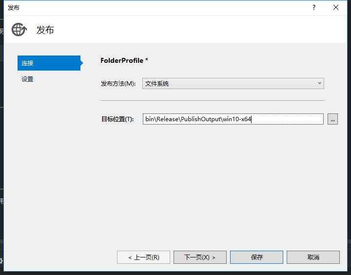
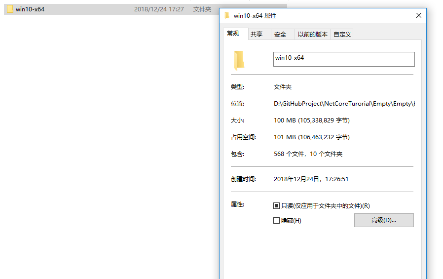

### 构建

使用VS ：


生成后`dll`路径为`bin\Debug\netcoreapp2.0`

使用命令行：

项目目录下执行
```bash
dotnet build
```
更多命令行信息[.NET Core CLI](https://docs.microsoft.com/zh-cn/dotnet/core/tools/?tabs=netcore2x)

>与 .NET Framework 的不同，构建的时候不会将第三方依赖(来自 NuGet)的库拷贝到当前项目的`Debug`目录下，而是直接读取NuGet的缓存。

### 发布

发布的时候，第三方依赖会被复制到发布目录下。

#### 依赖框架的发布
使用VS : 


使用命令行：
项目目录下执行
```bash
dotnet publish
```
这种发布方式不需要提前设置运行服务器的目标操作系统，只要安装有.NET Core运行时框架即可。


#### 独立的发布

使用VS :

修改项目`csproj`文件。

加入目标操作系统
```xml
<PropertyGroup>
    <TargetFramework>netcoreapp2.0</TargetFramework>
    <RuntimeIdentifiers>win10-x64;osx.10.11-x64</RuntimeIdentifiers>
  </PropertyGroup>
```
设置发布





使用命令行：
```bash
dotnet publish -c Release -r win10-x64
```
>命令行方式不需要配置csproj文件

这种方式就是每个应用程序自带.NET Core运行时环境与程序集依赖，部署的目标机器不需要安装.NET Core SDK，将应用程序文件夹拷贝过来就能运行。




