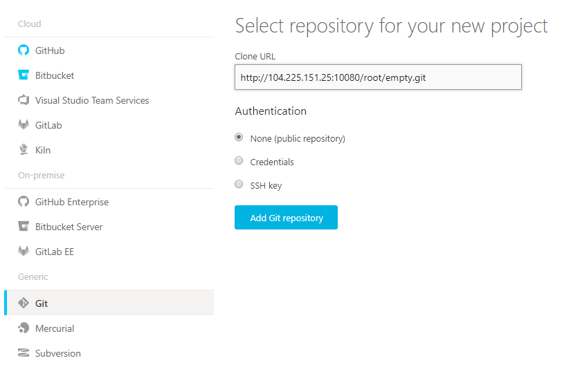
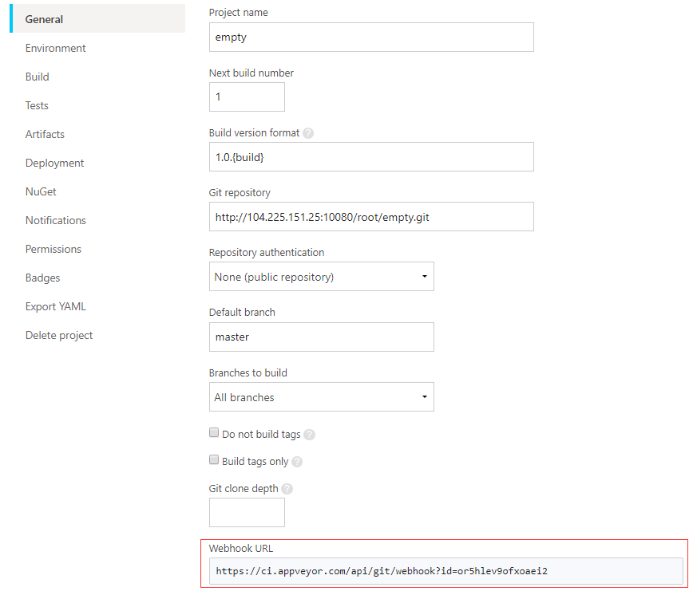
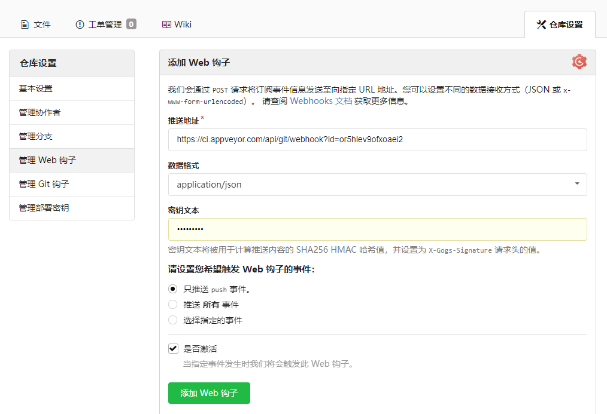
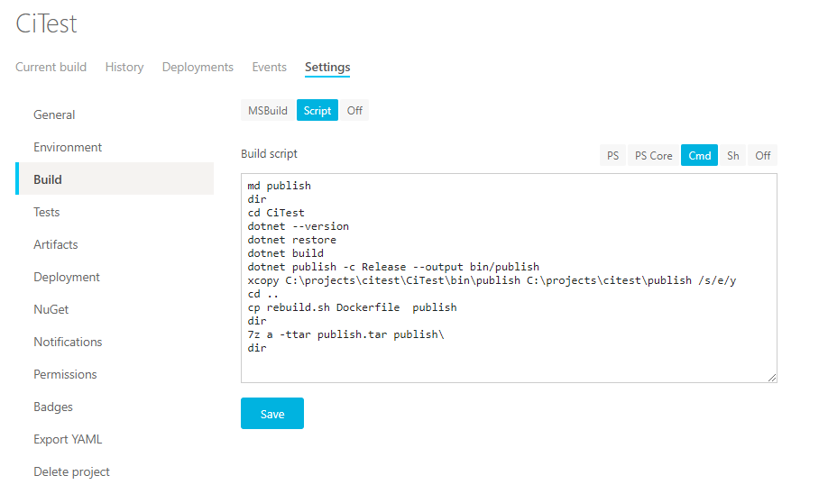

源码程序一般都会使用版本控制工具进行管理，比如Git，SVN。

配合持续集成工具(CI)使用，可以在代码更新的时候实现程序的自动构建和发布。

>目前比较流行的CI工具有Jenkins，GitLab CI，Drone，Travis CI，AppVeyor等


通过配置相应的钩子（hook），当代码变更的的时候，通知持续集成工具拉取最新的代码进行一系列自动化操作。

Git，SVN都支持钩子的配置，为了方便管理源码仓库，一般会使用仓库管理工具，也更加方便地配置相应的Webhooks。

>Git 比较流行的仓库管理工具有GitLab，Gogs，Github，Bitbucket等

### Gogs+AppVeyor

[Gogs](https://gogs.io/) 是一款极易搭建的自助 Git 仓库管理工具，相比GitLab更加轻便，也支持docker部署。


[AppVeyor](https://www.appveyor.com)是一个在线持续集成工具，对于开源的项目可以免费使用，支持Windows和Linux构建环境。

Gogs中创建一个新的仓库


根据相应的提示将本地代码提交到仓库。


在AppVeyor注册一个账号


也支持直接使用左侧的第三方登录。

使用刚才新建的仓库创建一个项目



拿到Webhook URL配置到Gogs中






编写构建脚本



```bash
md publish
```
创建publish文件夹

```bash
cd CiTest
dotnet --version
dotnet restore
dotnet build
dotnet publish -c Release --output bin/publish
```
执行构建，并且将程序发布到bin/publish文件夹

```bash
xcopy C:\projects\citest\CiTest\bin\publish C:\projects\citest\publish /s/e/y
cp rebuild.sh Dockerfile  publish
7z a -ttar publish.tar publish\
```
将发布后文件拷贝到之前创建的publish文件夹，并且将rebuild.sh也拷贝进去，然后将publish压缩为tar包

编写发布及部署脚本

