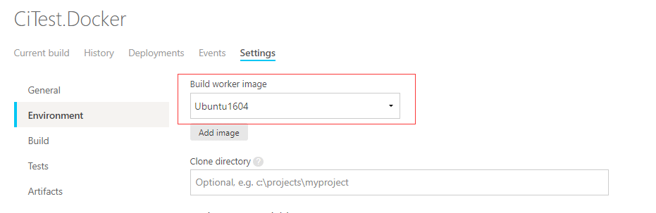
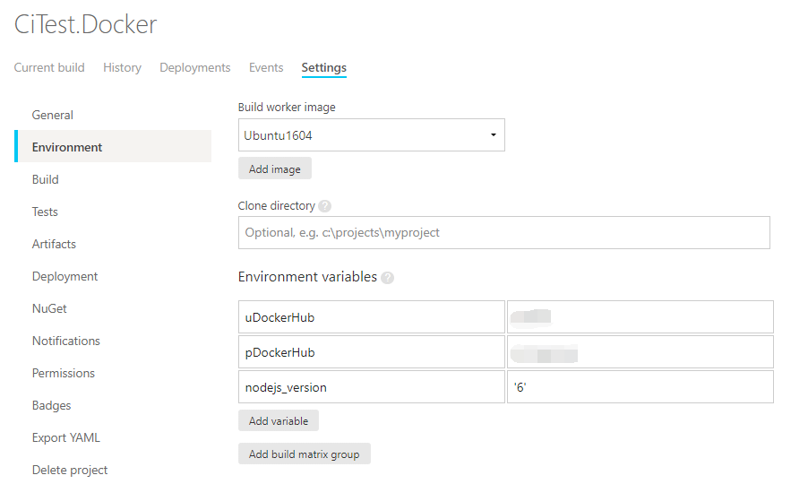
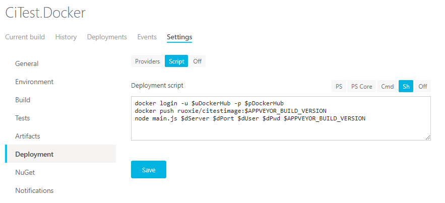

服务器内安装Docker，按着文档安装即可。[安装文档](https://docs.docker.com/install/linux/docker-ce/ubuntu/)


### 服务器内构建镜像

编译打包后的代码从CI工具发送到服务器后，使用服务器的docker环境构建镜像，并使用最新的镜像创建容器。


与之前使用Supervisor自动部署的区别是：

**rebuild.docker.sh**
```bash
#!/bin/bash
cd /publish
cd publish
docker stop citest
docker rm citest
docker rmi citestimage
docker build --rm -t citestimage -f Dockerfile .
docker run --name citest -p 5005:5001 -d citestimage
```
每次执行脚本的时候，停止容器，删除容器，删除旧镜像，构建新镜像，使用最新的镜像创建重新容器。

**Dockerfile**
```
from  microsoft/aspnetcore:2.0.0
COPY . /app
WORKDIR /app
EXPOSE 5001/tcp
ENTRYPOINT ["dotnet", "CiTest.dll"]
```

### CI工具内构建镜像

#### 流程

* CI工具内构建发布代码
* 直接使用CI工具内的Docker环境构建镜像
* 将镜像push到镜像仓库
* 通知服务器拉取新的镜像进行部署


#### 镜像仓库

使用**[Docker Hub](https://hub.docker.com/)**作为镜像仓库

注册账号后，创建一个仓库


#### CI工具

CI还是使用**appveyor**，但是环境切换到**Linux**下(因为构建的镜像也是在Linux下部署)，已经默认安装有Docker环境。


##### 配置环境变量



将**Docker Hub**账号密码配入环境变量中，并且设置nodejs版本

>**appveyor** **Linux**环境下SSH命令有问题，无法执行远程服务器脚本，也就无法通知服务器拉取新的镜像进行部署，所以使用nodejs连接远程服务器并且执行脚本

安装nodejs程序依赖


##### 编写Build脚本


```bash
dotnet --version
dotnet restore
dotnet build
dotnet publish -c Release --output /home/appveyor/projects/citest-uro3r/publish
docker build --rm -t ruoxie/citestimage:$APPVEYOR_BUILD_VERSION -f Dockerfile .
docker images
```

利用**appveyor**内置的**APPVEYOR_BUILD_VERSION**环境变量作为镜像Tag。

通过**docker images**就可以看到CI工具本地已经构建的新镜像。

##### 编写Tests脚本


```bash
docker run --name citestcontainer -p 5006:5001 -d ruoxie/citestimage:$APPVEYOR_BUILD_VERSION
docker logs citestcontainer
```

使用新的镜像创建容器，并查看日志。

##### 编写Deployment脚本



```bash
docker login -u $uDockerHub -p $pDockerHub
docker push ruoxie/citestimage:$APPVEYOR_BUILD_VERSION
node main.js $dServer $dPort $dUser $dPwd $APPVEYOR_BUILD_VERSION
```

首先登陆DockerHub，然后将最新的镜像push上去，完成后执行远程脚本，远程服务器拉取最新镜像重新部署。

`$dServer $dPort $dUser $dPwd` 分别为部署服务器的地址，端口，登陆用户，密码的环境变量


**main.js**就是使用nodejs远程执行shell脚本

```js
var ssh = require("./ssh");
var arg = process.argv.splice(2);

ssh.Shell({
    host: arg[0],
    port: arg[1],
    username: arg[2],
    password: arg[3]
}, 'image=`docker inspect citestcontainer|jq .[0].Config.Image`;echo $image;docker stop citestcontainer;docker rm -f citestcontainer;rmImage=`echo  ${image} | sed \'s/\\"//g\'`;docker rmi $rmImage;docker images;docker pull ruoxie/citestimage:'+arg[4]+';docker run --name citestcontainer -p 5006:5001 -d ruoxie/citestimage:'+arg[4]+';\nexit\n', function (data, buff) {
    console.log(buff);
});
```

相当于执行

```bash
ssh -p $dPort $dUser@$dServer "bash -s" <./rebuild.docker.sh $APPVEYOR_BUILD_VERSION
```
**rebuild.docker.sh**
```bash
#!/bin/bash
image=`docker inspect citestcontainer|jq .[0].Config.Image`
echo $image
docker stop citestcontainer
docker rm -f citestcontainer
rmImage=`echo  ${image} | sed 's/\"//g'`
docker rmi $rmImage
docker images
docker pull ruoxie/citestimage:$1
docker run --name citestcontainer -p 5006:5001 -d ruoxie/citestimage:$1
```
>要将sh文件用VSCODE修改行尾序列为LF或者vim DOS转UNIX :set ff=unix