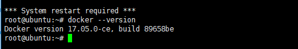
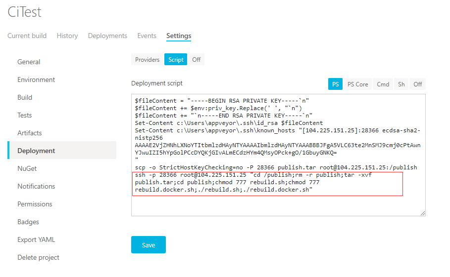

服务器内安装Docker，按着文档安装即可。[安装文档](https://docs.docker.com/install/linux/docker-ce/ubuntu/)



### 服务器内构建镜像

编译打包后的代码从CI工具发送到服务器后，使用服务器的docker环境构建镜像，并使用最新的镜像创建容器。



与之前使用Supervisor自动部署的区别是：

**rebuild.docker.sh**
```bash
#!/bin/bash
cd /publish
cd publish
docker stop citest
docker rm citest
docker rmi citestimage
docker build --rm -t citestimage -f Dockerfile .
docker run --name citest -p 5005:5001 -d citestimage
```
每次执行脚本的时候，停止容器，删除容器，删除旧镜像，构建新镜像，使用最新的镜像创建重新容器。

**Dockerfile**
```
from  microsoft/aspnetcore:2.0.0
COPY . /app
WORKDIR /app
EXPOSE 5001/tcp
ENTRYPOINT ["dotnet", "CiTest.dll"]
```

### CI工具内构建镜像
