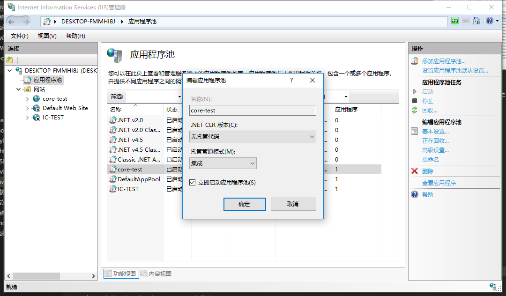

确保IIS已经安装`AspNetCoreModule`托管模块

[下载地址](https://github.com/dotnet/core/blob/master/release-notes/download-archives/2.0.0-download.md#windows-server-hosting)

然后像正常添加网站一样，添加发布后的文件路径。

最后将应用程序池修改为`无托管代码`模式

