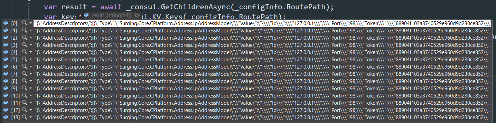
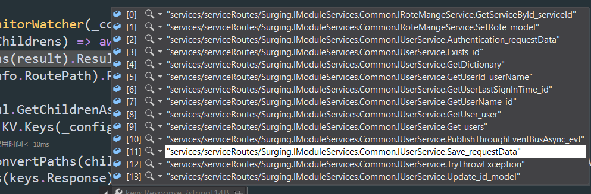
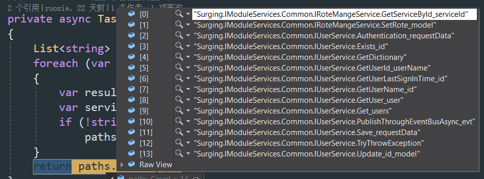
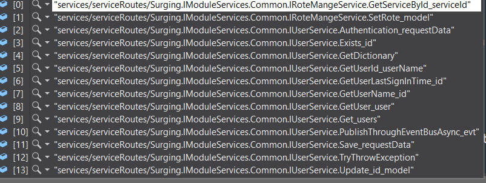

之前分析客户端路由调用的时候，并没有详细的分析如何从注册中心取回路由。

`ServiceProxyProvider`
```csharp
public async Task<T> Invoke<T>(IDictionary<string, object> parameters, string routePath, string serviceKey)
{
    var serviceRoute = await _serviceRouteProvider.GetRouteByPath(routePath.ToLower());
    T result = default(T);
    if (!string.IsNullOrEmpty(serviceKey))
    {
        var proxy = ServiceResolver.Current.GetService<RemoteServiceProxy>(serviceKey);
        if (proxy == null)
        {
            proxy = new RemoteServiceProxy(serviceKey, _serviceProvider);
            ServiceResolver.Current.Register(serviceKey, proxy);
        }
        result = await proxy.Invoke<T>(parameters, serviceRoute.ServiceDescriptor.Id);
    }
    else
    {
        var proxy = ServiceResolver.Current.GetService<RemoteServiceProxy>();
        if (proxy == null)
        {
            proxy = new RemoteServiceProxy(null, _serviceProvider);
            ServiceResolver.Current.Register(null, proxy);
        }
        result = await proxy.Invoke<T>(parameters, serviceRoute.ServiceDescriptor.Id);
    }
    return result;
}
```
!>routePath的例子为"`api/user/getuser`"

!>取回了路由，用到的主要是`ServiceDescriptor.Id`，也就是服务命令对应的Id，后面根据Id取到服务命令。

### DefaultServiceRouteProvider

服务在`AddCoreService`方法中注册：
`services.RegisterType(typeof(DefaultServiceRouteProvider)).As(typeof(IServiceRouteProvider)).SingleInstance();`

DefaultServiceRouteProvider中依赖`IServiceRouteManager`：
```csharp
private readonly ConcurrentDictionary<string, ServiceRoute> _concurrent = new ConcurrentDictionary<string, ServiceRoute>();
private readonly ConcurrentDictionary<string, ServiceRoute> _serviceRoute = new ConcurrentDictionary<string, ServiceRoute>();
private readonly IServiceRouteManager _serviceRouteManager;
public DefaultServiceRouteProvider(IServiceRouteManager serviceRouteManager, ILogger<DefaultServiceRouteProvider> logger)
{
    _serviceRouteManager = serviceRouteManager;
    serviceRouteManager.Changed += ServiceRouteManager_Removed;
    serviceRouteManager.Removed += ServiceRouteManager_Removed;
    serviceRouteManager.Created += ServiceRouteManager_Add;
    _logger = logger;
}
...
private static string GetCacheKey(ServiceDescriptor descriptor)
{
    return descriptor.Id;
}

private void ServiceRouteManager_Removed(object sender, ServiceRouteEventArgs e)
{
    var key = GetCacheKey(e.Route.ServiceDescriptor);
    ServiceRoute value;
    _concurrent.TryRemove(key, out value);
    _serviceRoute.TryRemove(e.Route.ServiceDescriptor.RoutePath, out value);
}

private void ServiceRouteManager_Add(object sender, ServiceRouteEventArgs e)
{
    var key = GetCacheKey(e.Route.ServiceDescriptor);
    _concurrent.GetOrAdd(key, e.Route);
    _serviceRoute.GetOrAdd(e.Route.ServiceDescriptor.RoutePath, e.Route);
}
...
```
!>_concurrent中键值为服务Id，_serviceRoute中键值为RoutePath。注册到serviceRouteManager相应事件上的委托也比较简单。

`IServiceRouteManager`的实现有`SharedFileServiceRouteManager`，`ConsulServiceRouteManager`，`ZooKeeperServiceRouteManager`。

以`ConsulServiceRouteManager`为例进行分析，服务注册：
```csharp
public static IServiceBuilder UseConsulRouteManager(this IServiceBuilder builder, ConfigInfo configInfo)
{
    return builder.UseRouteManager(provider =>
        new ConsulServiceRouteManager(
        configInfo,
        provider.GetRequiredService<ISerializer<byte[]>>(),
        provider.GetRequiredService<ISerializer<string>>(),
        provider.GetRequiredService<IClientWatchManager>(),
        provider.GetRequiredService<IServiceRouteFactory>(),
        provider.GetRequiredService<ILogger<ConsulServiceRouteManager>>()));
}
```
```csharp
public static IServiceBuilder UseRouteManager(this IServiceBuilder builder, Func<IServiceProvider, IServiceRouteManager> factory)
{
    builder.Services.RegisterAdapter(factory).InstancePerLifetimeScope();
    return builder;
}
```

中根据RoutePath获取服务路由：
```csharp
public ValueTask<ServiceRoute> GetRouteByPath(string path)
{
    _serviceRoute.TryGetValue(path.ToLower(), out ServiceRoute route);
    if (route == null)
    {
        return new ValueTask<ServiceRoute>(GetRouteByPathAsync(path));
    }
    else
    {
        return new ValueTask<ServiceRoute>(route);
    }
}
...
private async Task<ServiceRoute> GetRouteByPathAsync(string path)
{
    var routes = await _serviceRouteManager.GetRoutesAsync();
    var  route = routes.FirstOrDefault(i => i.ServiceDescriptor.RoutePath == path);
    if (route == null)
    {
        if (_logger.IsEnabled(LogLevel.Warning))
            _logger.LogWarning($"根据服务路由路径：{path}，找不到相关服务信息。");
    }
    else
        _serviceRoute.GetOrAdd(path, route);
    return route;
}
...
```
>从serviceRouteManager取回全部服务路由，根据RoutePath进行过滤，将目标路由缓存在_serviceRoute中。

### ConsulServiceRouteManager

```csharp
public override async Task<IEnumerable<ServiceRoute>> GetRoutesAsync()
{
    await EnterRoutes();
    return _routes;
}
...
private async Task EnterRoutes()
{
    if (_routes != null && _routes.Length > 0)
        return;

    var watcher = new ChildrenMonitorWatcher(_consul, _manager, _configInfo.RoutePath,
        async (oldChildrens, newChildrens) => await ChildrenChange(oldChildrens, newChildrens),
            (result) => ConvertPaths(result).Result);
    if (_consul.KV.Keys(_configInfo.RoutePath).Result.Response?.Count() > 0)
    {
        var result = await _consul.GetChildrenAsync(_configInfo.RoutePath);
        var keys = await _consul.KV.Keys(_configInfo.RoutePath);
        var childrens = result;
        watcher.SetCurrentData(ConvertPaths(childrens).Result.Select(key => $"{_configInfo.RoutePath}{key}").ToArray());
        _routes = await GetRoutes(keys.Response);
    }
    else
    {
        if (_logger.IsEnabled(Microsoft.Extensions.Logging.LogLevel.Warning))
            _logger.LogWarning($"无法获取路由信息，因为节点：{_configInfo.RoutePath}，不存在。");
        _routes = new ServiceRoute[0];
    }
}
```
`ChildrenMonitorWatcher`的逻辑在分析服务命令的时候已经详细介绍过，之前是基于CommandPath进行watch，这里是根据RoutePath。

```csharp
public static async Task<string[]> GetChildrenAsync(this ConsulClient client, string path)
{
    try
    {
        var queryResult = await client.KV.List(path);
        return queryResult.Response?.Select(p => Encoding.UTF8.GetString(p.Value)).ToArray();
    }
    catch (HttpRequestException)
    {
        return null;
    }
}
```
`GetChildrenAsync`获取的内容项类似：
```js
{
  "AddressDescriptors": [
    {
      "Type": "Surging.Core.CPlatform.Address.IpAddressModel",
      "Value": "{\"Ip\":\"127.0.0.1\",\"Port\":98,\"Token\":\"88904f103a3740529e960d9d230ce852\",\"DisableAuth\":false}"
    }
  ],
  "ServiceDescriptor": {
    "Id": "Surging.IModuleServices.Common.IRoteMangeService.GetServiceById_serviceId",
    "RoutePath": "api/rotemange/getservicebyid",
    "Metadatas": {
      "EnableAuthorization": false
    }
  }
}
```


`_consul.KV.Keys(_configInfo.RoutePath)`取回的内容：



!>RoutePath默认值为"`services/serviceRoutes/`"

!>ConsulServiceRouteManager构造函数中也会调用EnterRoutes方法。

```csharp
private async Task<string[]> ConvertPaths(string[] datas)
{
    List<string> paths = new List<string>();
    foreach (var data in datas)
    {
        var result = await GetRouteData(data);
        var serviceId = result?.ServiceDescriptor.Id;
        if (!string.IsNullOrEmpty(serviceId))
            paths.Add(serviceId);
    }
    return paths.ToArray();
}
```
`ConvertPaths`方法处理后返回内容类似：


就是服务Id列表。

`ChildrenMonitorWatcher`属性_currentData数据为：



` _routes = await GetRoutes(keys.Response);`：
```csharp
private async Task<ServiceRoute[]> GetRoutes(IEnumerable<string> childrens)
{

    childrens = childrens.ToArray();
    var routes = new List<ServiceRoute>(childrens.Count());

    foreach (var children in childrens)
    {
        if (_logger.IsEnabled(Microsoft.Extensions.Logging.LogLevel.Debug))
            _logger.LogDebug($"准备从节点：{children}中获取路由信息。");

        var route = await GetRoute(children);
        if (route != null)
            routes.Add(route);
    }

    return routes.ToArray();
}
private async Task<ServiceRoute> GetRoute(string path)
{
    ServiceRoute result = null;
    var watcher = new NodeMonitorWatcher(_consul, _manager, path,
            async (oldData, newData) => await NodeChange(oldData, newData));
    var queryResult = await _consul.KV.Keys(path);
    if (queryResult.Response != null)
    {
        var data = (await _consul.GetDataAsync(path));
        if (data != null)
        {
            watcher.SetCurrentData(data);
            result = await GetRoute(data);
        }
    }
    return result;
}
```
`var queryResult = await _consul.KV.Keys(path);`调用参数例子"services/serviceRoutes/Surging.IModuleServices.Common.IRoteMangeService.GetServiceById_serviceId"，`queryResult.Response`不为空例子"services/serviceRoutes/Surging.IModuleServices.Common.IRoteMangeService.GetServiceById_serviceId"

`GetDataAsync`方法直接根据path获取字节数据：
```csharp
public static async Task<byte[]> GetDataAsync(this ConsulClient client, string path)
{
    try
    {
        var queryResult = await client.KV.Get(path);
        return queryResult.Response?.Value;
    }
    catch (HttpRequestException)
    {
        return null;
    }
}
```

转为字符串例子为：
```js
{
  "AddressDescriptors": [
    {
      "Type": "Surging.Core.CPlatform.Address.IpAddressModel",
      "Value": "{\"Ip\":\"127.0.0.1\",\"Port\":98,\"Token\":\"88904f103a3740529e960d9d230ce852\",\"DisableAuth\":false}"
    }
  ],
  "ServiceDescriptor": {
    "Id": "Surging.IModuleServices.Common.IRoteMangeService.GetServiceById_serviceId",
    "RoutePath": "api/rotemange/getservicebyid",
    "Metadatas": {
      "EnableAuthorization": false
    }
  }
}
```

### 路由注册

```csharp
public static IServiceHostBuilder UseServer(this IServiceHostBuilder hostBuilder, string ip, int port, string token="True")
{
    return hostBuilder.MapServices(mapper =>
    {
        mapper.Resolve<IServiceCommandManager>().SetServiceCommandsAsync();
        var serviceEntryManager = mapper.Resolve<IServiceEntryManager>();
        bool enableToken;
        string serviceToken;
        string _ip = ip;
        if (ip.IndexOf(".") < 0 || ip == "" || ip == "0.0.0.0")
        {
            NetworkInterface[] nics = NetworkInterface.GetAllNetworkInterfaces();
            foreach (NetworkInterface adapter in nics)
            {
                if (adapter.NetworkInterfaceType == NetworkInterfaceType.Ethernet && (ip == "" || ip == "0.0.0.0" || ip == adapter.Name))
                {
                    IPInterfaceProperties ipxx = adapter.GetIPProperties();
                    UnicastIPAddressInformationCollection ipCollection = ipxx.UnicastAddresses;
                    foreach (UnicastIPAddressInformation ipadd in ipCollection)
                    {
                        if (ipadd.Address.AddressFamily == System.Net.Sockets.AddressFamily.InterNetwork)
                        {
                            _ip = ipadd.Address.ToString();
                        }
                    }
                }
            }
        }

        if (!bool.TryParse(token,out enableToken))
        {
                serviceToken= token;
        }
        else
        {
            if(enableToken) serviceToken = Guid.NewGuid().ToString("N");
            else serviceToken = null;
        }
        var addressDescriptors = serviceEntryManager.GetEntries().Select(i =>
        new ServiceRoute
        {
            Address = new[] { new IpAddressModel { Ip = _ip, Port = port, Token= serviceToken } },
            ServiceDescriptor = i.Descriptor
        }).ToList();
        mapper.Resolve<IServiceRouteManager>().SetRoutesAsync(addressDescriptors);
        var serviceHost = mapper.Resolve<Runtime.Server.IServiceHost>();
        Task.Factory.StartNew(async () =>
        {
            await serviceHost.StartAsync(new IPEndPoint(IPAddress.Parse(_ip), port));
        }).Wait();
    });
}
```
调用`mapper.Resolve<IServiceRouteManager>().SetRoutesAsync(addressDescriptors);`进行服务路由的注册。


